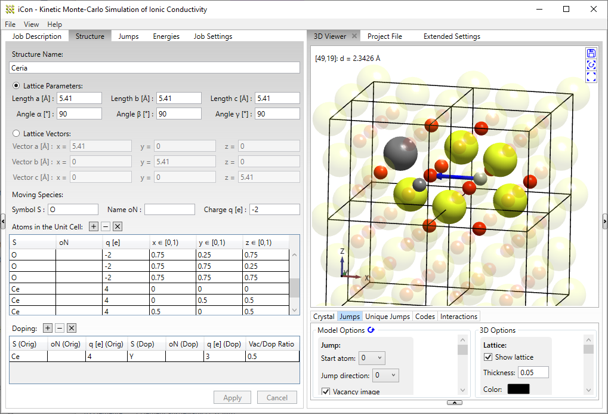

# iCon: Ionic conductivity in crystalline solids
Kinetic Monte-Carlo simulation of vacancy-based ion conduction in arbitrary crystalline structures, based on user-supplied activation energy models.

This code was developed by Philipp Hein at the Institute of Physical Chemistry, RWTH Aachen University, Germany, under the supervision of Prof. Manfred Martin.

**Setup (latest release)**: [iCon Setup.msi](https://github.com/phi-hein/iCon/releases/latest/download/iCon-Setup.msi)  
(see [installation requirements](#installation-requirements) and [citation/license information](#license-information))

Project homepage: [www.icon.pc.rwth-aachen.de](https://www.icon.pc.rwth-aachen.de/)  
DOI (scientific article): [10.1016/j.matchemphys.2020.123767](https://doi.org/10.1016/j.matchemphys.2020.123767)  
DOI (citable archive): ...

## Features
- Graphical user interface (GUI) for setting up the KMC simulations
- Automatic submission of KMC jobs to remote computer clusters
- Supports every crystalline structure and both cation or anion transport
- Different doping scenarios: no doping, single dopand type or multiple dopings
- Flexible modelling of jump activation energies, depending on the surrounding atoms  
  (from explicit energies for each possible environment to pure pair interactions)
- Ion transport with and without electric field
- _and more_

## Installation requirements
- Supported operating systems (GUI): Win 10 or later
- Before installing iCon, please ensure that the following two components are installed:  
  (otherwise the setup will complain)
  - Microsoft .NET 9.0 (x86) or later ([link](https://aka.ms/dotnet/9.0/windowsdesktop-runtime-win-x86.exe))
  - Microsoft Visual C++ 2015-2022 Redistributable (x86) 14.3 or later ([link](https://aka.ms/vs/17/release/vc_redist.x86.exe))  
	(x86 runtimes are required even on x64 systems)

## Documentation
- [Tutorial](https://www.icon.pc.rwth-aachen.de/tutorial.html): Overview of the iCon workflow
- [User manual](/Docs/USER_MANUAL.md): Additional explanations for using the software
- [Output files specification](/Docs/FILE_SPEC.md): Description of the quantities in the output files
- [Developer manual](/Docs/DEV_MANUAL.md): Guides for working on this project
- [Changelog](CHANGELOG.md)

## Related publications
- S\. Grieshammer, S. Eisele, J. Koettgen, _Journal of Physical Chemistry C_ 2018, 122, 33, 18809–18817 ([DOI](https://doi.org/10.1021/acs.jpcc.8b04361))
- J\. Koettgen, S. Grieshammer, P. Hein, B.O.H. Grope, M. Nakayama and M. Martin, _Physical Chemistry Chemical Physics_ 2018, 20, 14291-14321 ([DOI](https://dx.doi.org/10.1039/C7CP08535D))
- J\.R. Köttgen, _Ph.D. thesis_, RWTH Aachen University, 2017 ([DOI](http://dx.doi.org/10.18154/RWTH-2017-01919))
- J\. Koettgen, T. Zacherle, S. Grieshammer and M. Martin, _Physical Chemistry Chemical Physics_ 2017, 19, 9957-9973 ([DOI](https://dx.doi.org/10.1039/C6CP04802A))
- B\.O.H. Grope, _Ph.D. thesis_, RWTH Aachen University, 2015 ([RWTH Publications](https://publications.rwth-aachen.de/record/658793))
- S\.P. Grieshammer, _Ph.D. thesis_, RWTH Aachen University, 2015 ([RWTH Publications](https://publications.rwth-aachen.de/record/481133))
- S\. Grieshammer, B.O.H. Grope, J. Koettgen and M. Martin, _Physical Chemistry Chemical Physics_ 2014, 16, 9974-9986 ([DOI](http://dx.doi.org/10.1039/C3CP54811B))

## License information
This code is &copy; P. Hein, 2016-2025, and it is made available under the GPL v3 license enclosed with the software.

Over and above the legal restrictions imposed by this license, if you use this software or modified variants of it, for example for an academic publication, then you are obliged to provide proper attribution by citing the following paper:

"Kinetic Monte Carlo simulations of ionic conductivity in oxygen ion conductors"  
P\. Hein, B.O.H. Grope, J. Koettgen, S. Grieshammer and M. Martin  
_Materials Chemistry and Physics_ 2021, 257, 123767  
DOI: [10.1016/j.matchemphys.2020.123767](https://doi.org/10.1016/j.matchemphys.2020.123767)  
